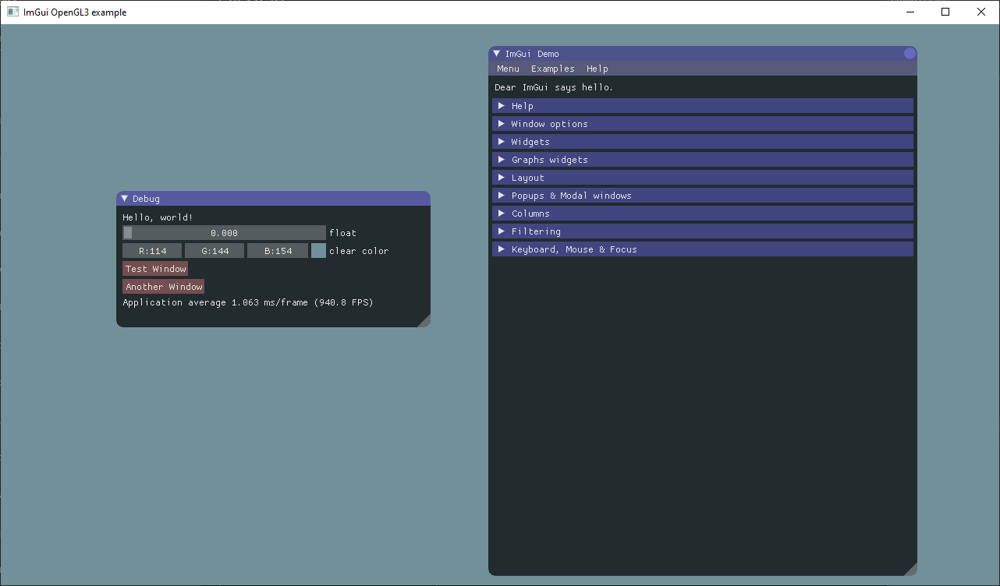

# imgui-opengl-glfw-cmake-demo

This is a demo project for [ImGui](https://github.com/ocornut/imgui) with [opegl](https://www.opengl.org/), [glfw3](http://www.glfw.org/), [glew](http://glew.sourceforge.net/) and [CMake](https://cmake.org/). 

This project generates a stand alone demo app. Currently it has been built only on Apple and Windows environments, and, due to the structure of the project, linux builds should theoretically take minimal effort.


---------------------

## A brief explanation of ImGui

It's easy to use simple GUI library for C++. It suits for 3D pipeline enabled application. The easiest way is just copy and add libraries in your project. That's all.

The next citations are from it's [README](https://github.com/ocornut/imgui).

> dear imgui (AKA ImGui), is a bloat-free graphical user interface library for C++. It outputs optimized vertex buffers that you can render anytime in your 3D-pipeline enabled application. It is fast, portable, renderer agnostic and self-contained (no external dependencies).
  
> ImGui is designed to enable fast iteration and empower programmers to create content creation tools and visualization/ debug tools (as opposed to UI for the average end-user). It favors simplicity and productivity toward this goal, and thus lacks certain features normally found in more high-level libraries.

-------------------------

## How to build this project

### Mac

Install libraries:

```bash
$ /usr/bin/ruby -e "$(curl -fsSL https://raw.githubusercontent.com/Homebrew/install/master/install)" # Install homebrew
$ brew update
$ brew install cmake # Install CMake
$ brew install glfw # Install glfw3
$ brew install glew # Install glew
``` 

Build and generate a stand alone app:

```bash
$ cd /to/project/root/
$ mkdir build && cd build
$ cmake ..
$ make
```

Or you can build and run with [CLion](https://www.jetbrains.com/clion/).

You'll find the app in the build directry.

### Windows (Visual Studio)

#### 1. Install Packages with [vcpkg](https://aka.ms/vcpkg)
##### A. Install GLFW
With command prompt or powershell, navigate to the folder where vcpkg is installed and execute the following commands to download the 64-bit and 32-bit versions of GLFW, respectively.
```dos
vcpkg install glfw3:x64-windows
vcpkg install glfw3:x86-windows
```
##### B. Install GLEW
Vcpkg can also install GLEW with the following commands
```dos
vcpkg install glew:x64-windows
vcpkg install glew:x86-windows
```
##### C. Verify (optional)
Check that the packages were installed with the command `vcpkg list`

At this point, running CMake on the root directory of this project should finish without errors.

#### 2. Try it out!
Select `imgui-demo.app.exe` from the dropdown menu of startup items and press the big play button. A window should appear with fun knobby controls.



### Linux

*Currently no instructions - Your contribution is welcomed.*

-------------------------------

## References

- [ocornut/imgui: Bloat-free Immediate Mode Graphical User interface for C++ with minimal dependencies](https://github.com/ocornut/imgui)
- [OpenGL - The Industry Standard for High Performance Graphics](https://www.opengl.org/)
- [GLFW - An OpenGL library](http://www.glfw.org/)
- [GLEW: The OpenGL Extension Wrangler Library](http://glew.sourceforge.net/)
- [CMake](https://cmake.org/)
- [Homebrew — The missing package manager for macOS](http://brew.sh/)


-------------------------------

## Contributions
* [**m516**](https://github.com/m516): Windows support and documentation

This project was originally a by-product of my learning of CMake and ImGui. Your comments and pull request are always welcomed. 
